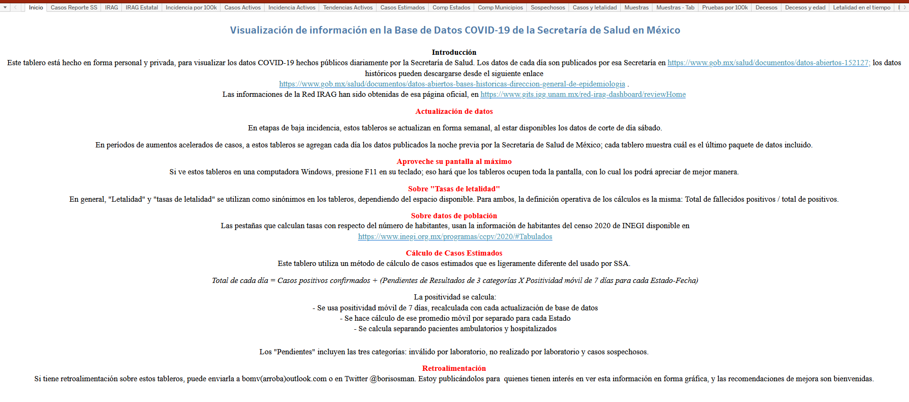
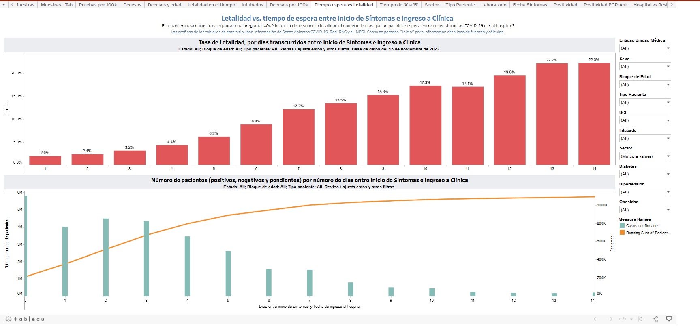
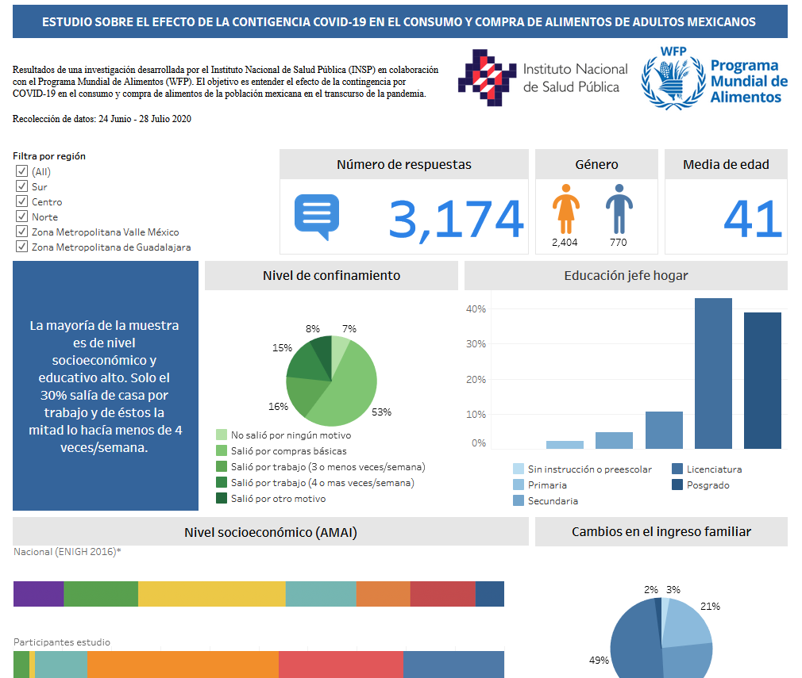

# Panorama del COVID-19 con ciencia de datos

## Presentación

¡Bienvenidos a nuestro trabajo final! Este es nuestra entrega final del programa BEDU - Data science.

### Notebook del proyecto

> :link: [**Notebook (Google Colab)**](https://colab.research.google.com/drive/1lOVjCrQj6WXIYUIltd-HJbfb0LCIzpBC?usp=sharing)

> :link: [**Notebook (GitHub)**](https://github.com/AlefoElfo/D1-Data-science-prototype-14/blob/main/Equipo14_ProyectoFinalPython.ipynb)

GitHub limita el tamaño de archivos, así que te recomendamos que abras el notebook desde Google Colab.

### Integrantes 🏃‍♂️🏋️‍♂️⛹️‍♂️

|id|Nombre|LinkedIn|GitHub|WhatsApp|
|---|---|---|---|---|
|GASA|Alef Gama|[Linked In](https://www.linkedin.com/in/alefzain/)|[GitHub](https://github.com/AlefoElfo)|[Enviar mensaje](https://api.whatsapp.com/send?phone=5521199543)|
|CAMJ|Javier Castillo|[Linked In]()|[GitHub]()|[Enviar mensaje](https://api.whatsapp.com/send?phone=525537534193)|
|RUCM|Moisés Rubio|[Linked In](https://www.linkedin.com/in/moisesrubio/)|[GitHub](https://github.com/MoisesRub)|[Enviar mensaje](https://api.whatsapp.com/send?phone=50764819801)|

## Identificación del problema :dart:

En el siguiente workbook estamos analizando el comportamiento de la pandemia COVID-19, en México, para tratar de resolver algunas dudas  relacionadas con la mortalidad y enfermedad de acuerdo con los datos reportados por el gobierno.

### DUDAS:

- ¿Cuál ha sido la mortalidad del covid en México?
- ¿Cual es el promedio de días entre la presentación de sintomas y fué ingresado el paciente?
- ¿Cual es la diferencia del promedio de días entre la presentación de sintomas y el ingreso del paciente de las personas que fallecieron y las que no fallecieron?
- ¿Cuál ha sido la mortalidad de covid en México despues de que las personas han sido intubadas?
- ¿Cuál ha sido el porcentaje de población intubado?
- ¿Cuantos días pasa una persona en el hospital despues de ser internada?
- ¿Cuantos días pasan en que se internaron y murieron?
- ¿Cuantas personas no fueron internadas y recibieron tratamiento en casa?

### FUMADORES
Una vez resueltas las preguntas procedemos con una investigación sobre la relación que hay entre el COVID-19 y los fumadores a través de una prueba A/B Test y a través de un árbol de decisiones.

## Investigación previa

Investigando nos damos cuenta que hay mucha información sobre este tema, encontramos unos dashboards creados con información de la secretaría de salud.

Hay mucha información disponible. Algunas preguntas necesitamos verificarlas.

Fuente: :link: [Dashboard con información de COVID-19](https://public.tableau.com/views/COVID-19Mexico/TiempoesperavsLetalidad?%3Aembed=y&%3Aembed=y&%3AshowVizHome=no&%3AshowVizHome=n&%3Adisplay_count=y&%3Adisplay_static_image=y&%3Alanguage=en&%3Amobile=true&%3AapiID=host0)

También encontramos información sobre el comportamiento de compras de alimenos con información adicional que amplían la perspectiva sobre las investigaciones previas.

Fuente: :link: [Workbook](https://analytics.wfp.org/t/Public/views/MexicoEstudiosobreelefectodelacontigenciaCOVID-19enelconsumoycompradealimentosdeadultosmexicanos/Dashboard?iframeSizedToWindow=true&%3Aembed=y&%3AshowAppBanner=false&%3Adisplay_count=no&%3AshowVizHome=no&%3Aorigin=viz_share_link)

## Glosario básico

- Coronavirus

  Los coronavirus son una familia de virus que causan enfermedades (desde el resfriado común hasta enfermedades respiratorias más graves) y circulan entre humanos y animales.

  En este caso, se trata del SARS-COV2. Apareció en China en diciembre del 2019 y provoca una enfermedad llamada COVID-19, que se extendió por el mundo y fue declarada pandemia global por la Organización Mundial de la Salud.
  :link: [The science of where](https://covid-19-mexico-sigsamx.hub.arcgis.com/)

- Síntomas:

  Las enfermedades reportadas han variado desde síntomas leves hasta enfermedades graves y muerte por casos confirmados de enfermedad por coronavirus 2019 (COVID-19).

  Los siguientes síntomas pueden aparecer de 2 a 14 días después de la exposición (según los períodos de incubación del virus MERS-CoV anteriores).

  Tos, fiebre y dificultad para respirar :link: [The science of where](https://covid-19-mexico-sigsamx.hub.arcgis.com/)

- Hospitalizaciones:

  En el Hospital Central Militar se hospitalizaron 4401 pacientes, 35 % derechohabientes, 26 % civiles, 28 % militares en activo y solo 11 %, militares retirados. Predominó el sexo masculino, tanto en los pacientes hospitalizados como en los que fallecieron, el grupo O+ y la ausencia de comorbilidades; entre las comorbilidades que se observaron, las principales fueron el sobrepeso y la diabetes. La mediana de edad de los pacientes hospitalizados fue de 49 años, mientras que 62 años fue la edad de quienes fallecieron; las mujeres mayores de 51 años tuvieron mayor riesgo de fallecer. La tasa de letalidad ajustada fue de 18.5 %; 50 % falleció durante los primeros seis días. :link: [Gaceta médica de México](https://www.scielo.org.mx/scielo.php?script=sci_arttext&pid=S0016-38132021000300246
)

## Recolección y carga de datos

Estuvimos buscando datos que nos ayudaran a resolver las preguntas planteadas y encontramos en la página de datos.gob.mx un dataset que nos podría ayudar a resolver las preguntas que nos hemos planteado

|||
| --- | :---|
|**Fuente:** | :link: [datos.gob.mx](https://datos.gob.mx/busca/dataset/informacion-referente-a-casos-covid-19-en-mexico) |
|**Respaldo de fuente:** | :link: [Google Drive](https://drive.google.com/drive/folders/1fDQmTgMGcjhA-o7jSx9RMIzdqKQBNlG9?usp=sharing) |
|**Archivos:** | Disponibles para descarga desde la fuente. Los descriptores y catálogos también están en la carpeta :link: [Datos](https://github.com/AlefoElfo/D1-Data-science-prototype-14/tree/main/Datos), de este repositorio |

Notas:

- La información de la fuente está actulizada el 2020-04-14
- Más adelante se importará el dataset directamente desde la fuente.
